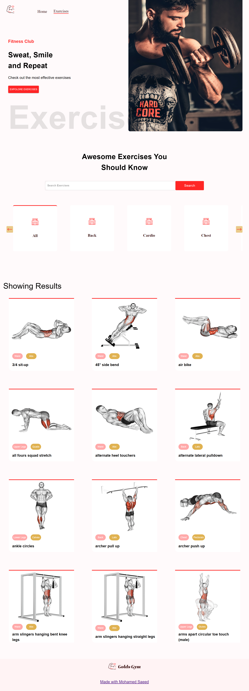
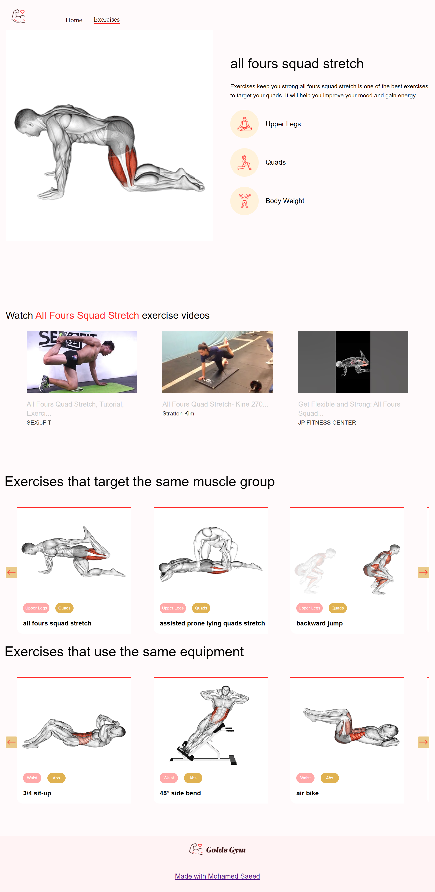

# Exercise Exploration Web App

Welcome to the Exercise Exploration Web App! This project is designed to help fitness enthusiasts explore various exercises, body parts, equipment, and muscles to enhance their workout routines.

## Features

### Page 1: Exercise Search

- **Search Exercises**: Discover exercises based on body parts, equipment, and target muscles.
- **Body Parts**: Explore exercises categorized by different body parts.
- **Equipment**: Find exercises based on available fitness equipment.
- **Muscles**: Delve into exercises targeting specific muscle groups.

### Page 2: Exercise Details

- **Exercise Details**: In-depth insights into selected exercises, including proper form and variations.
- **Related Videos**: Collection of instructional exercise videos for visualization and technique enhancement.
- **Target Muscle Exercises**: Discover exercises targeting similar muscle groups.
- **Related Equipment Exercises**: Explore exercises utilizing similar fitness equipment.

## Libraries Used

- **react**
- **react-redux/Toolkit**
- **MUI**
- **axios**
- **react-router-dom**
- **react-horizontal-scrolling-menu**
- **Rapid-api**
## Live Demo

Explore the live version of the Exercise Exploration Web App:

[Live Demo](https://mosaeed-fitnessapp.netlify.app/)

---
## Project Designs

Home Page Design 

Details Page Design 

## Usage

To get started with the Exercise Exploration Web App:

1. Clone this repository.
2. Navigate to the project directory.
3. Install dependencies using `npm install` or `yarn install`.
4. Run the application using `npm start` or `yarn start`.

## Contributions

Contributions are welcome! Feel free to submit issues, feature requests, or pull requests to help improve this project.

